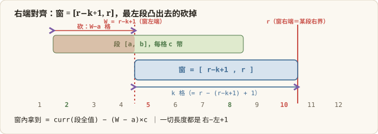

## 🎙️ Naive Solution
The naive approach is to flatten the coins across every single position and apply a standard step-by-step sliding window. However, since the coins are grouped in continuous intervals, stepping through empty spaces or uniform segments one by one is computationally wasteful. We can calculate the amount of coins in a covered interval directly without moving the window one tiny step at a time.

## 🚀 Pitch

### The Bottleneck Observation (對齊法則)
The core insight is that to maximize the collected coins, we can greedily align the boundary of our window with the boundary of an existing interval. If both ends of the window fall into empty spaces, we could seamlessly shift the window left or right without losing any coins until it hits a boundary. 

### The Strategy: Two-Pass Sliding Window
After an O(N log N) sorting step, I will use a **Two-Pass Sliding Window** approach to evaluate the intervals in strictly O(N) time.
1. **Pass 1 (Aligning Right):** We assume the window ends exactly at the right boundary of the current interval. 
2. **Pass 2 (Aligning Left):** We assume the window starts exactly at the left boundary of the current interval.

### The Precise Execution (精準的滑動與截斷邏輯)
Taking Pass 1 as an example: as we iterate through the intervals, we unconditionally add the current interval's total coins to our running sum. The window strictly covers `[r - k + 1, r]`. 
We then use a `left` pointer to aggressively shed any intervals that fall completely outside the left bound of our window (`intervals[left].end < r - k + 1`). 
Finally, the leftmost interval inside the window might be partially covered. We calculate the exact out-of-bound portion (`window_left_bound - interval_left_bound`) and temporarily subtract it from our running sum to evaluate the exact coins for the current window state. We repeat a symmetric logic for Pass 2.



**Complexity**
- **Time — O(N log N):** Dominated by the initial sorting of intervals. The sliding windows run strictly in O(N).
- **Space — O(1):** In-place evaluation without extra auxiliary arrays.


## 🛠️ Optimization (最佳化程式碼)
```cpp
class Solution {
public:
    long long maximumCoins(vector<vector<int>>& coins, int k) {

        sort(coins.begin(), coins.end());
        int n = coins.size();
        
        int left = 0;
        
        long long res = 0;
        long long curr = 0;
        // Align with the right boundry
        // [r-k+1,r]
        for (int right = 0; right < n; right++) {
            int l = coins[right][0];
            int r = coins[right][1];
            int c = coins[right][2];

            curr += 1LL * (r - l + 1) * c;
            
            while (r-k+1 > coins[left][1]) {
                curr -= 1LL * (coins[left][1] - coins[left][0] + 1) * coins[left][2];
                left++;
            }

            long long coin = curr - max(0LL, 1LL * ((r-k+1) - coins[left][0])) * coins[left][2];
            res = max(res, coin);
        }

        curr = 0;
        // Align with the left boundry
        // [l, l+k-1]
        int right = n-1;
        for (int left = n-1; left >= 0; left--) {
            int l = coins[left][0];
            int r = coins[left][1];
            int c = coins[left][2];

            curr += 1LL * (r - l + 1) * c;
            
            while (l+k-1 < coins[right][0]) {
                curr -= 1LL * (coins[right][1] - coins[right][0] + 1) * coins[right][2];
                right--;
            }

            long long coin = curr - max(0LL, 1LL * (coins[right][1] - (l+k-1))) * coins[right][2];
            res = max(res, coin);
        }

        return res;
    }
};
```
