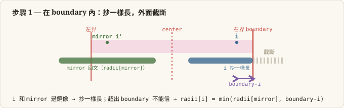
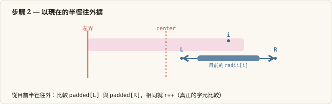
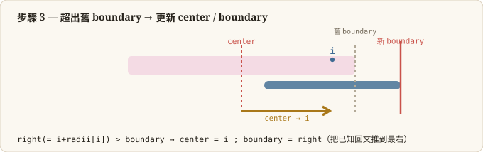

## 🎙️ Naive Solution
The brute-force idea is to expand around every possible center and grow outward while both sides
match. There are `2N - 1` centers (each character plus each gap), and each expansion can cost up to
O(N), giving **O(N^2)** time overall.

## 🚀 Pitch

### The Bottleneck Observation
Plain "expand around center" throws away work: neighboring centers overlap heavily, yet each one
re-scans characters that a previous center already proved to be part of a palindrome.

### The Strategy: Manacher's Algorithm
First transform the string by inserting `#` between every character (and at both ends), so odd- and
even-length palindromes are handled uniformly. Keep a `radii` array plus the current palindrome's
`center` and right `boundry`. When a new index `i` falls inside the current boundary, mirror its
radius from `2 * center - i` and reuse that known value instead of expanding from zero.


### The Precise Calculation / Execution
- For each `i`, seed `radii[i]` from its mirror if `i < boundry`, capped by `boundry - i`.
- Expand outward with two pointers (`left`, `right`) while the characters match.
- If the expansion pushes past the current `boundry`, update `center` and `boundry`.
- Track `max_center` / `max_length`, then map back to the original string with
  `s.substr((max_center - max_length) / 2, max_length)`. This yields **O(N)** time.

**Complexity**
- **Time — O(N):** each character is visited once; mirror reuse bounds the total expansion work.
- **Space — O(N):** the `#`-padded string plus the `radii` array each hold `2N + 1` entries.

### 每個 i 的三步驟（演算法本體）
Manacher 的核心不是背 case，而是每個 `i` 都跑這三步——剛好對應程式碼的三段：抄+截斷 → 展開 → 超出就更新。







---

## 🛠️ Optimization
```c++
class Solution {
public:
    string longestPalindrome(string s) {
        string str = "#";
        for (char c: s) {
            str += c;
            str += "#";
        }

        int n = str.length();
        vector<int> radii(n, 0);
        int center = 0;
        int boundry = 0;

        int max_center = 0;
        int max_length = 0;

        for (int i = 0; i < n; i++) {

            if (i < boundry) {
                int mirror = 2 * center - i;
                radii[i] = min(boundry - i, radii[mirror]);
            }

            int right = radii[i] + i + 1;
            int left = -radii[i] + i - 1;
            while (right < n && left >= 0 && str[right] == str[left]) {
                right++;
                left--;
            }

            right--;
            radii[i] = right - i;
            if (right > boundry) {
                center = i;
                boundry = right;
            }

            if (radii[i] > max_length) {
                max_center = i;
                max_length = radii[i];
            }
        }

        return s.substr((max_center - max_length)/2, max_length);
    }
};
```
